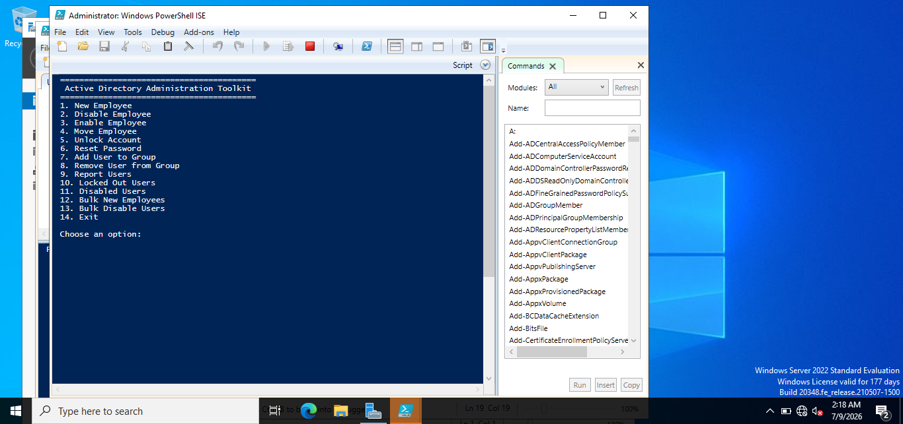
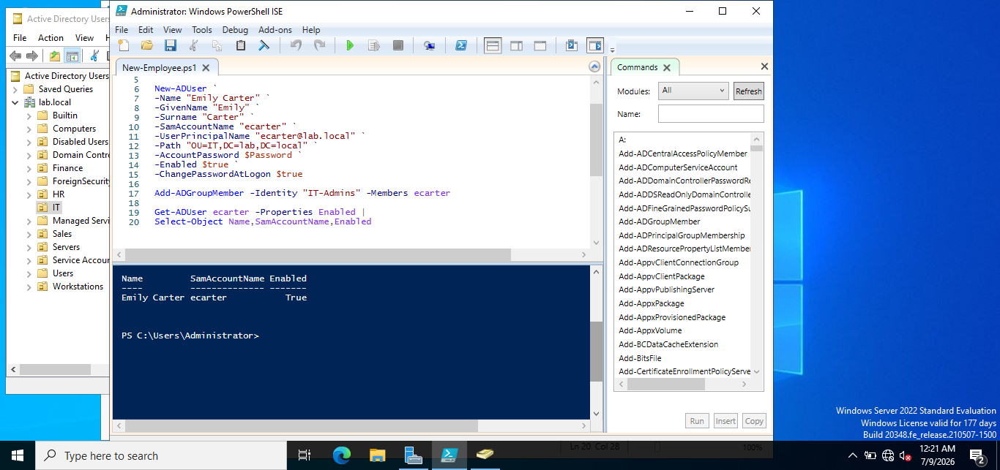
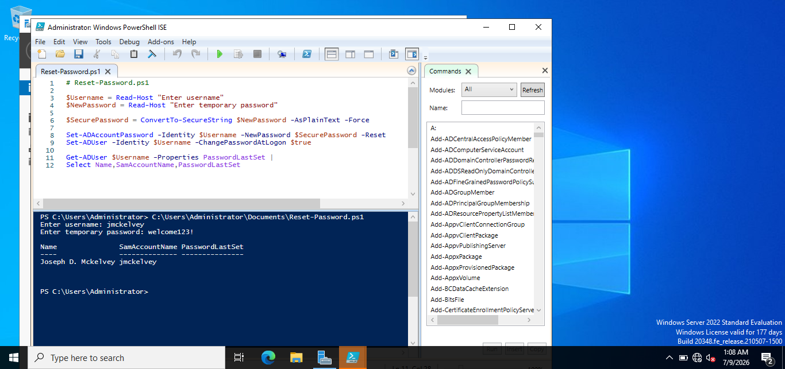
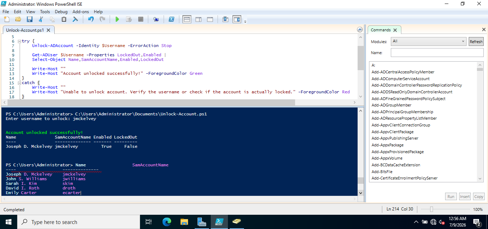
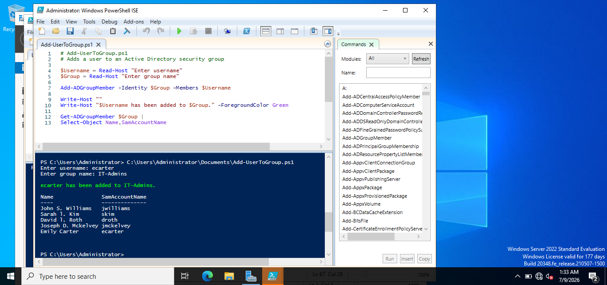
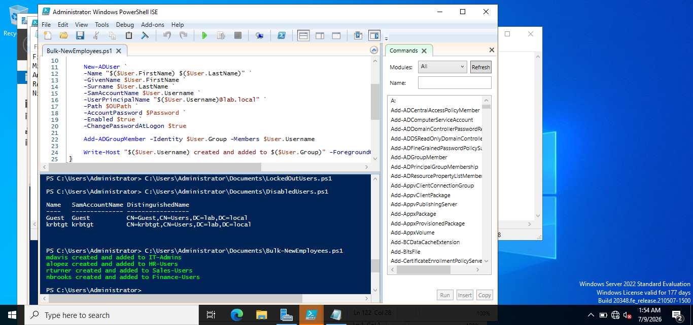
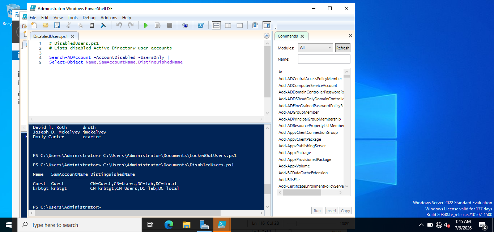
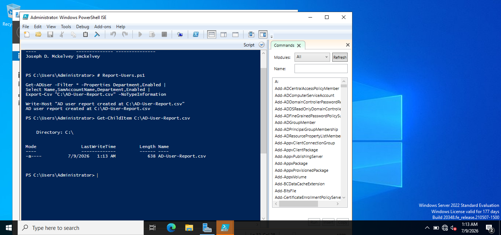
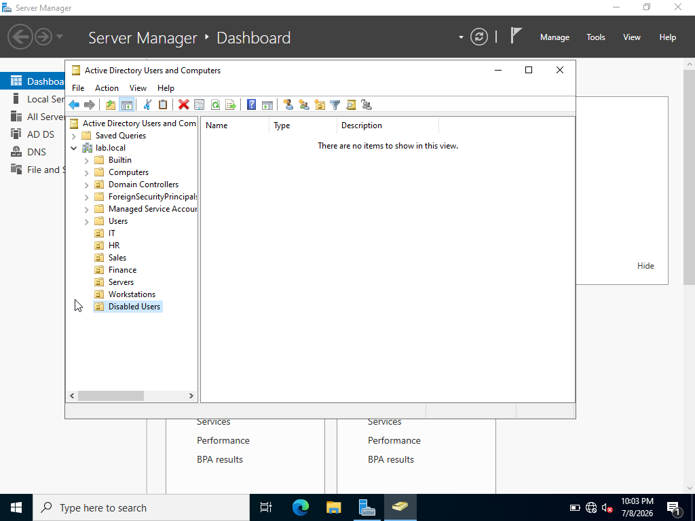
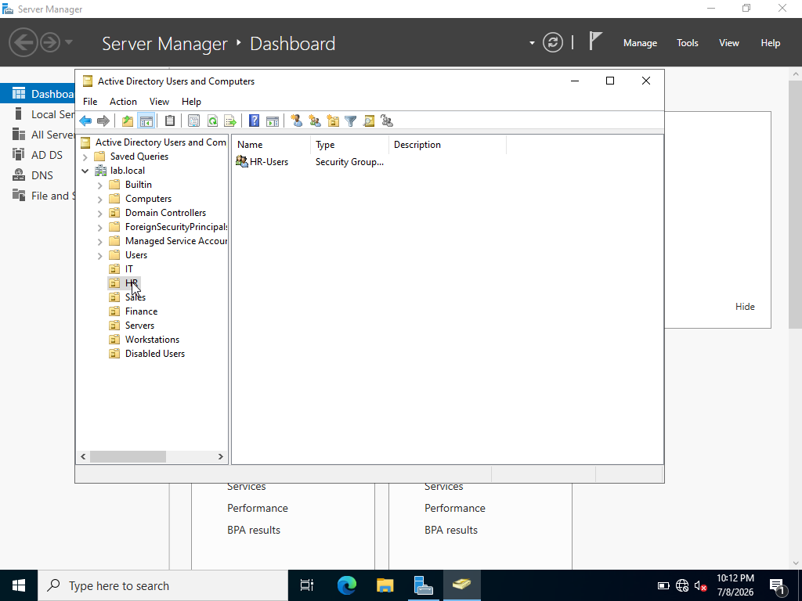

# PowerShell-Automation-Toolkit
A collection of PowerShell automation scripts for Windows Server and Active Directory, demonstrating Help Desk automation, user lifecycle management, reporting, and administrative scripting.
# ⚡ PowerShell Automation Toolkit

<p align="center">
  <strong>Enterprise PowerShell Automation for Windows Server & Active Directory</strong>
</p>

<p align="center">


</p>

---

## 📖 Overview

This repository contains a collection of PowerShell scripts created to automate common Active Directory and Windows Server administration tasks.

The project simulates real-world Help Desk and System Administration workflows including user provisioning, password management, security group administration, reporting, and bulk account management. Every script was built and tested in a Windows Server 2022 Active Directory lab.

---

# 🚀 Project Goals

- Automate repetitive administrative tasks
- Improve Help Desk efficiency
- Reduce manual errors
- Demonstrate practical PowerShell scripting
- Build reusable administration tools

---

# 🛠 Technologies

| Technology | Purpose |
|------------|---------|
| Windows Server 2022 | Server Platform |
| Active Directory | Identity Management |
| PowerShell 5.1 | Automation |
| RSAT | AD Administration |
| CSV | Bulk User Imports |
| Git | Version Control |
| GitHub | Documentation |

---

# 📂 Repository Structure

```text
PowerShell-Automation-Toolkit
│
├── README.md
├── LICENSE
│
├── assets
│   ├── banner
│   ├── diagrams
│   └── screenshots
│       ├── active-directory
│       └── powershell
│
├── csv
│
├── docs
│
└── scripts
    ├── Admin-Toolkit
    ├── Bulk-Operations
    ├── Group-Management
    ├── Password-Management
    ├── Reporting
    └── User-Management
```

---

# ⚙️ Toolkit Features

✅ User Provisioning

✅ Password Resets

✅ Account Unlocks

✅ User Enable / Disable

✅ Employee Transfers

✅ Security Group Administration

✅ Bulk User Creation

✅ Bulk User Disable

✅ Active Directory Reporting

✅ Administrative Toolkit

---

# 📜 Script Library

| Script | Description |
|---------|-------------|
| AdminToolkit.ps1 | Menu-driven administration console |
| New-Employee.ps1 | Creates new Active Directory users |
| Enable-Employee.ps1 | Enables disabled accounts |
| Disable-Employee.ps1 | Disables Active Directory users |
| Move-Employee.ps1 | Moves users between Organizational Units |
| Reset-Password.ps1 | Resets user passwords |
| Unlock-Account.ps1 | Unlocks locked accounts |
| Add-UserToGroup.ps1 | Adds users to security groups |
| Remove-UserFromGroup.ps1 | Removes users from security groups |
| Bulk-NewEmployees.ps1 | Creates users from CSV |
| Bulk-DisableUsers.ps1 | Disables users from CSV |
| DisabledUsers.ps1 | Reports disabled users |
| LockedOutUsers.ps1 | Reports locked users |
| Report-Users.ps1 | Exports Active Directory reports |

---

# 🔄 Automation Workflow

```text
Administrator
      │
      ▼
PowerShell Script
      │
 ┌────┼────────────┐
 │    │            │
Users Groups    Reports
 │    │            │
 └────┼────────────┘
      ▼
Active Directory
```

---

# 📸 Screenshot Gallery

## Administrative Toolkit



---

## Create New User



---

## Password Reset



---

## Unlock Account



---

## Add User To Group



---

## Remove User From Group


---

## Bulk User Creation



---

## Disabled Users Report



---

## User Report



---

## Active Directory




```

---

# 💻 Example PowerShell

```powershell
Get-ADUser -Filter * |
Select Name,Enabled,Department |
Export-Csv ".\Users.csv" -NoTypeInformation
```

```powershell
Unlock-ADAccount jsmith
```

```powershell
Set-ADAccountPassword jsmith -Reset
```

---

# 🎯 Skills Demonstrated

- PowerShell Scripting
- Active Directory Administration
- Windows Server Administration
- Identity & Access Management
- User Lifecycle Management
- Security Group Administration
- Help Desk Automation
- CSV Processing
- Administrative Reporting
- Technical Documentation

---

# 📈 Future Improvements

- Advanced Logging
- Enhanced Error Handling
- PowerShell Modules
- Parameter Validation
- Microsoft Graph Integration
- Microsoft 365 Automation
- Microsoft Entra ID Automation
- Windows Forms GUI

---

# 📚 Lessons Learned

Building this toolkit improved my understanding of PowerShell automation, Active Directory administration, and the value of scripting repetitive IT tasks. Creating reusable scripts reinforced best practices in automation, documentation, and operational efficiency while simulating the responsibilities of Help Desk Technicians and System Administrators.

---

# 👨‍💻 Author

**Joseph Mckelvey**

GitHub: https://github.com/jdmckelvey

LinkedIn: https://www.linkedin.com/in/josephmckelvey

---

⭐ If you found this project helpful or interesting, feel free to star the repository.
